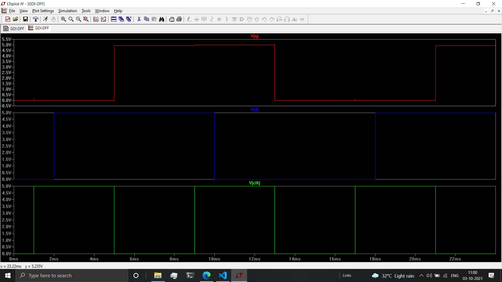
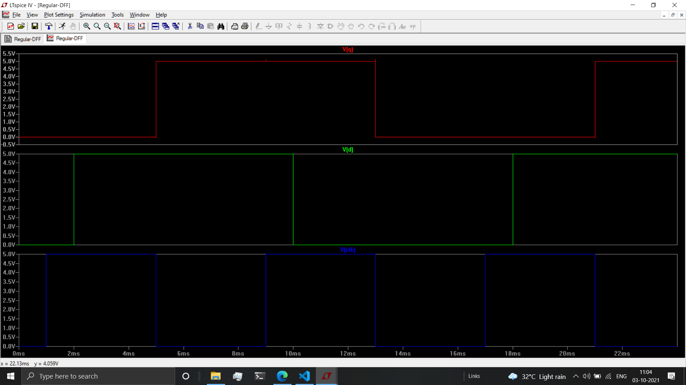

# ECE-BTP

This is a summary of Electronics and Communication Engineering Btech project.

### Project Title

Fast and Efficient D-Flip Flop.

### Team Members

1. Nanubala Gnana Sai - S20180020225.
2. Sai Harjun R - S20180020239.

### Mentor

Dr. Sivaprasad Kotamraju.

## About

The project is aimed at improvising the speed and reduce the power-delay product of D-Flip Flop's (DFF). DFF play an important role acting as memory registers, frequency dividors among many other things.

## Progress

Currently the GDI technique has been used to decrease the power dissipation and compared against a regular D-Flip Flop. The following are the results.

